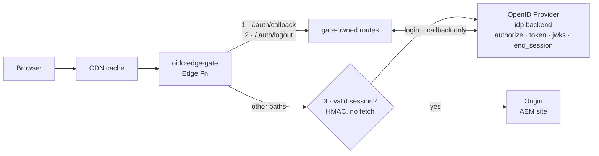

# oidc-edge-gate

An [AEM Edge Function](https://experienceleague.adobe.com/en/docs/experience-manager-cloud-service/content/implementing/developing/edge-functions) that sits in front of an [Edge Delivery Services](https://www.aem.live/) site and enforces access on **every request** via a **three-tier path policy**. It acts as an OpenID Connect **relying party** (OAuth client): requests are classified `public` (forwarded with no auth), `protected` (unauthenticated HTML clients are sent through the authorization-code-with-PKCE flow), or `secured` (unauthenticated API/XHR clients get a `401 JSON`). Only valid, in-policy sessions reach the protected tiers.

AEM Edge Functions run on the [Fastly Compute](https://www.fastly.com/documentation/guides/compute/) JavaScript runtime and execute at the CDN layer, between the CDN cache and the origin — exactly where an access gate belongs.

## Background

Putting auth *inside* the site means every page, asset and API has to remember to check it, and unauthenticated requests still reach (and can be cached by) the origin. Pushing it to the edge means **nothing reaches origin without a valid session**, the check happens before the cache, and the site itself stays oblivious to OIDC.

The tricky constraint is AEM's **hard limit of 32 `fetch()` (backend) calls per execution**. A naive design that re-validates the IdP's JWT against the JWKS endpoint on every request would be both slow and quota-hungry. So this gate splits the work:

- **Once per login** (the auth-code flow): talk to the IdP — discovery, token exchange, and full RS256 JWT validation against the JWKS.
- **Every request after that**: validate the gate's *own* HMAC-signed session cookie locally, with **zero backend calls**, then pass through to origin.

## Architecture



### Request lifecycle

1. **Every request** enters the edge function first.
2. If the path is `/.auth/callback` or `/.auth/logout`, the gate handles it.
3. Otherwise the path is **classified** against the policy (most-specific rule wins): `public` is forwarded straight to origin before the cookie is even read.
4. For `protected`/`secured`, the gate reads the `__Host-edge_session` cookie and verifies its HMAC signature + `exp` **locally** — no backend round-trip.
5. **Valid + in policy (audience)** → identity is attached as `x-auth-*` headers and the request is forwarded to the EDS `origin` backend (Host rewrite, `X-Forwarded-Host`, `X-Push-Invalidation`; per-user responses are kept out of every cache — `Surrogate-Control: private` + `Cache-Control: private, no-store`). Authenticated-but-wrong-audience → `403`.
6. **No/expired session** → `secured` paths get a `401 JSON`; `protected` paths mint a `state`/`nonce`/PKCE verifier in a short-lived signed cookie and 302 to the IdP's `authorization_endpoint`.
7. The IdP redirects back to `/.auth/callback`; the gate checks `state` (constant-time + single-use replay marker), exchanges the `code` for tokens, validates the `id_token` (RS256 against JWKS; `iss`/`aud`/`azp`/`sub`/`exp`/`iat`/`nbf`/`nonce` + `c_hash`/`at_hash`), mints the session cookie, and bounces the user back to where they started.

## Project structure

```
oidc-edge-gate/
├── src/
│   ├── index.js        # Edge Function entry point — routing + three-tier classify
│   ├── policy.js       # classify(path) -> tier/audience; isAuthorized(session, audience)
│   ├── origin.js       # EDS BYO-CDN forward: Host/X-Forwarded-Host, cache suppression, x-auth-* injection
│   ├── oidc.js         # Relying party: auth-code+PKCE flow, callback, logout
│   ├── jwt.js          # RS256 ID-token validation against JWKS (+ KV-cached discovery/JWKS)
│   ├── session.js      # Mint/verify the HMAC-signed session + transient login-state cookies
│   ├── pkce.js         # PKCE verifier/challenge + random state/nonce
│   ├── cookies.js      # Cookie parse/serialize + HMAC sign/unsign
│   ├── config.js       # Loads config from ConfigStore + secrets from SecretStore (+ opens KV cache)
│   └── encoding.js     # base64url, UTF-8, constant-time compare helpers
├── config/
│   ├── edgeFunctions.yaml  # AEM service declaration (configs + secrets + origins)
│   ├── cdn.yaml            # CDN routing snippet (route host -> function, define EDS origin)
│   └── local.config.json   # Local ConfigStore values (dev only)
├── test/               # node-vitest unit + negative-matrix suite (75 tests) with fastly:* stubs
├── vitest.config.js    # aliases fastly:config-store/secret-store/kv-store/cache-override -> stubs
├── fastly.toml         # Fastly CLI manifest for local build/serve
└── package.json
```

## Security model

- **Session cookie** (`__Host-edge_session`): the `__Host-` prefix makes the browser enforce `Secure` + `Path=/` + no `Domain` (no subdomain or non-secure context can plant/override it). Also `HttpOnly`, `SameSite=Lax`, HMAC-SHA256 signed with `session_hmac_key` (≥ 32 bytes, enforced at config load). Carries `sub`, `email`, `groups`, `iat`, `exp`. Tampering breaks the signature; expiry and strict shape are enforced on read. The `groups` claim is read **only** from the configured `groups_claim` (no `roles` fallback) and normalized to an array of strings.
- **Path normalization**: every request path is normalized *before* routing/classification — encoded `/`/`\` and malformed escapes are rejected (`400`), the path is percent-decoded, and repeated slashes are collapsed; the same normalized path is forwarded to origin so the gate and origin agree on what was requested (no `//protected` / `%70rotected` bypass).
- **CSRF / replay**: `state` is compared in constant time **and burned single-use** via a KV marker; if the replay cache is unavailable the callback **fails closed** (a missing cache is treated as misconfiguration, not a normal mode). `nonce` is bound into the ID token; PKCE (S256) protects the code exchange. Callback validation failures return a generic `400`/`401` (internal detail is logged with an `x-auth-request-id`, never echoed) so rejection is observable without aiding reconnaissance.
- **Discovery**: the OIDC discovery document is validated on use — `issuer` must match config, and the authorization/token/jwks endpoints must be secure URLs (https, or http only on loopback for local dev).
- **ID-token validation**: RS256 only (`alg=none` rejected), signature against JWKS with a single refetch on `kid` miss (key rotation), and `iss`/`aud`/`azp` (incl. the multi-valued-`aud` rule)/`sub`/`exp` (required)/`iat`/`nbf`/`nonce` + `c_hash`/`at_hash` when present.
- **Open redirect**: the post-login `returnTo` is resolved against the origin and restricted to same-origin relative paths (catches `//evil.com` and `/\evil.com`).
- **Origin trust**: the gate strips the inbound `Cookie` header **and any client-supplied `x-auth-*` / `x-push-invalidation` headers** before injecting trusted `x-auth-subject` / `x-auth-email` / `x-auth-groups` (so identity can't be spoofed on the public tier). The origin should only trust these when reached *through* the edge.
- **Authorization**: a **three-tier path policy** (`public`/`protected`/`secured`) with optional per-rule `audience`; most-specific rule wins, unmatched paths fall to `default_tier` (deny-by-default `protected`). Authenticated-but-wrong-audience → `403`.
- **Caching** (two caches, two levers — see [AEM edge-functions caching](https://experienceleague.adobe.com/en/docs/experience-manager-cloud-service/content/implementing/developing/edge-functions-caching)): the **function cache** (function↔origin) is bypassed on every tier via `CacheOverride({ mode: "pass" })`, because EDS can't yet purge it on publication (a cached entry would go stale with no eviction path; a future out-of-band "observe publish → purge by surrogate key" job would let public tiers opt back in). The **outer AEM CDN** is kept off per-user/auth responses with `Surrogate-Control: private`; the **browser** with `Cache-Control: private, no-store`. Public responses set neither, so the outer CDN still caches them via the origin's passed-through headers.

## Configuration

Set non-secret values in `config/edgeFunctions.yaml` under `configs:` (exposed via `ConfigStore("config_default")`) and secrets under `secrets:` (Cloud Manager → `SecretStore("secret_default")`). The platform provisions these stores with fixed names (`config_default`, `secret_default`, and `kv_default` from `kvs: true`) — they are not renameable:

| Key | Where | Example |
| --- | --- | --- |
| `issuer` | config | `https://your-tenant.okta.com` |
| `client_id` | config | `0oaEXAMPLEclientid` |
| `redirect_uri` | config | `https://www.example.com/.auth/callback` |
| `scopes` | config | `openid profile email groups` |
| `session_ttl_seconds` | config | `3600` |
| `routes` | config (JSON) | `{"callback":"/.auth/callback","logout":"/.auth/logout"}` |
| `policy` | config (JSON) | `{"rules":[{"path":"/","tier":"public"},{"path":"/protected/*","tier":"protected"},{"path":"/api/*","tier":"secured"}],"default_tier":"protected"}` (deny-by-default: list each public path explicitly; a `/*` rule would flip the whole site to public) |
| `backends` | config (JSON) | `{"origin":"origin","idp":"idp"}` |
| `origin_hostname` | config | `main--<site>--<org>.aem.live` (EDS delivery host) |
| `forwarded_host` | config | `www.example.com` (sent as `X-Forwarded-Host`) |
| `push_invalidation` | config | `enabled` |
| `groups_claim` | config | `groups` (the id_token claim carrying group membership) |
| `client_secret` | secret | `${{OIDC_CLIENT_SECRET}}` |
| `session_hmac_key` | secret | `${{OIDC_SESSION_HMAC_KEY}}` (≥ 32 bytes) |
| `recaptcha_secret` | secret | `${{RECAPTCHA_SECRET_KEY}}` (only needed if a `policy` rule sets `recaptcha: true`) |
| `recaptcha_min_score` | config | `0.5` (v3 only; ignored for v2 checkbox/invisible responses, which carry no score) |

Generate a suitable key with OpenSSL (produces 44 printable characters; 32 bytes of entropy):

```bash
openssl rand -base64 32
```

Each `policy` rule is `{ "path": <glob>, "tier": "public"|"protected"|"secured", "audience"?: [<group>], "upstream"?: <url>, "headers"?: {<name>: <value>}, "recaptcha"?: <boolean> }`. An `audience` requires the session's `groups` to intersect it (e.g. `{"path":"/protected/medical/*","tier":"protected","audience":["medical"]}`). `upstream` proxies the route to a different origin-base URL instead of the EDS default, path preserved (e.g. `{"path":"/api/*","tier":"secured","upstream":"https://swapi.dev"}`); when set, EDS BYO-CDN and identity (`x-auth-*`) headers are not sent, since the target may be a third party.

`headers` attaches static name→value pairs to the request forwarded to whichever origin the route resolves to (EDS or an `upstream`), applied last so they override any client-supplied header of the same name. A top-level `default_headers` (sibling of `rules`/`default_tier`) applies to **every route that forwards to the EDS origin** — it is deliberately withheld from any rule's `upstream` override, since that may be a third party (a `default_headers` secret meant to gate your own origin must never leak to, say, `swapi.dev`). A rule's own `headers` has no such restriction and is sent regardless of target, e.g. an API key scoped to that specific upstream. This is particularly useful for a shared secret the real origin can require, so it rejects any request that didn't come through the gate — e.g. locking down a form-submission endpoint from direct access:

```json
{"path":"/form/*","tier":"public","upstream":"https://forms.example.com","headers":{"x-edge-gate-secret":"<shared secret>"}}
```

Reserved names (`host`, `cookie`, `set-cookie`, `x-forwarded-host`, `x-push-invalidation`, and anything starting with `x-auth-`) are gate-managed and rejected at config load if set via `headers`/`default_headers`.

Note that both `headers` and `default_headers` live in the `policy` value under `configs:` (ConfigStore), which is **plaintext** — unlike `client_secret`/`session_hmac_key`, there's no way to source a header value from a Cloud Manager secret. Treat any value placed here as no more protected than the rest of `edgeFunctions.yaml`.

`recaptcha: true` requires a `POST` to that route to carry a `g-recaptcha-response` field (`application/x-www-form-urlencoded` or `multipart/form-data`), verified against Google's [siteverify API](https://developers.google.com/recaptcha/docs/verify) using the `recaptcha_secret` secret before the request is forwarded. A missing/failed token gets a generic `400 {"error":"recaptcha_failed"}`; a `recaptcha: true` rule with no `recaptcha_secret` configured fails closed with `500` rather than letting unverified submissions through. `GET` requests to the same route aren't checked (nothing to validate — e.g. loading the form page itself). This only checks `success` (and, for reCAPTCHA v3, `score` against `recaptcha_min_score` if the response carries one) — it does not itself rate-limit or otherwise restrict the route, so pair it with `headers`/`default_headers` (above) if you also want to keep the origin from being hit directly.

At the IdP, register `redirect_uri` as an allowed callback and (if used) `https://www.example.com/` as a post-logout redirect.

## Prerequisites

- [Node.js](https://nodejs.org/) ≥ 18
- [Fastly CLI](https://www.fastly.com/documentation/reference/cli/) (local build/serve)
- [`aio` CLI](https://developer.adobe.com/app-builder/docs/get_started/app_builder_get_started/set-up/) with the AEM plugin (AEM deploy)
- An OIDC client registered at your provider (Okta, Entra ID, Ping, Auth0, …)

## Local development

```bash
cd oidc-edge-gate
npm install

# Edit config/local.config.json and the secret/backend stubs in fastly.toml,
# then run the function locally:
npm run dev          # fastly compute serve  -> http://127.0.0.1:7676
```

Hitting a `protected` path without a session redirects you to the IdP; after login you land back on the original path with `__Host-edge_session` set. `/.auth/logout` clears it. `public` paths pass through untouched; `secured` paths without a session return `401 JSON`.

## Testing

```bash
npm test               # Layer 1: vitest run — 75 unit + negative-matrix tests (node)
npm run test:integration  # Layer 2: real Wasm under Viceroy — 32 end-to-end assertions
```

**Layer 1** runs under **plain node-vitest** (not Viceroy): the pure OIDC/JWT/session/policy modules use native Web Crypto, and the four `fastly:*` platform modules are aliased to in-memory stubs (`test/stubs/`) via `vitest.config.js`. It reproduces the conformance negative matrix (bad signature, `alg=none`, wrong `iss`/`aud`, expired/missing `exp`, future `iat`, bad nonce, `kid` miss + single refetch, multi-`aud` `azp` rule, `c_hash`/`at_hash` mismatch, state mismatch/replay, PKCE mismatch, open-redirect) plus the three-tier gate flow and the `x-auth-*` spoofing-strip.

**Layer 2** builds the real Wasm and runs it under **Viceroy** (`fastly compute serve --env integration`, requires the Fastly CLI), with a dependency-free mock OP + stub origin started on localhost (`test/integration/`). It drives the full auth-code-with-PKCE round trip (authorize → callback → session → forward) and asserts the live Fastly platform behaviour the node stubs can't: named-backend routing with Host rewrite reaching the origin, `CacheOverride`, `Headers.getSetCookie()` cookie stripping, audience gating, single-use-state replay rejection, and logout. See [worker-gate-parity-plan.md](worker-gate-parity-plan.md) §5 for Layer 3 (hosted OIDF conformance, needs a deployed endpoint).

## Deploying to AEM

```bash
# 1. Add config/edgeFunctions.yaml + config/cdn.yaml to your AEM project repo.
# 2. Create the Cloud Manager secrets OIDC_CLIENT_SECRET and OIDC_SESSION_HMAC_KEY.
# 3. Build + deploy the function:
npm run aem:build    # aio aem edge-functions build
npm run aem:deploy   # aio aem edge-functions deploy oidc-edge-gate
```

Traffic for the configured hostname then routes through the gate before reaching origin.

## Notes & limitations

- This is a research / reference implementation, not a hardened product.
- Session revocation is time-based only (cookie `exp`); there's no server-side session store, so shortening `session_ttl_seconds` is the main revocation lever. A KV-backed denylist keyed on `sub`/`jti` would be a natural extension.
- Only the `id_token` is validated; access/refresh tokens aren't persisted. Add refresh handling if you need long-lived sessions without re-login.
- **RP-initiated logout** sends `client_id` + `post_logout_redirect_uri` but **not** `id_token_hint` — the `id_token` isn't persisted in the session. Some providers (e.g. Entra ID, some Keycloak configs) won't honour `end_session` without it; if you target one, persist the `id_token` (or its hint) in the session and pass it through. Logout still clears the local session either way.
- **`/.auth/logout` is a GET**, so it's CSRF-able (a third-party page could force-logout a user via an ``). Impact is low (logout only), but gate it behind a same-site referer check or a POST if that matters for your deployment.
- The single-use `state` replay markers (and the discovery/JWKS cache) are written with a native KV `ttl` so they're evicted rather than growing unbounded; an embedded `expires` is the read-side fallback for backends that don't honour native TTL.
- Watch the **32 backend requests per execution** ceiling — the design keeps authenticated requests at a single origin fetch and caches discovery/JWKS in KV. A `recaptcha: true` POST adds one more (Google's siteverify, uncached — each token is single-use, so there's nothing to cache), still well within budget.
