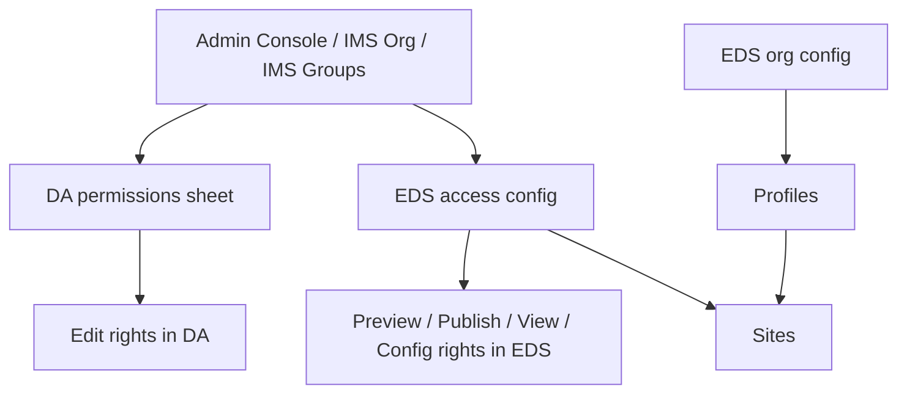

### EDS + DA user and group management summary

#### Short answer

For **editing**, use **DA as the RBAC layer**.  
For **preview / publish / site config / runtime access**, use **EDS access config**.  

Those are **separate permission systems** and should be designed that way from the start.

**Sources:**
- [DA and Edge Delivery permissions are managed separately](https://adobe.enterprise.slack.com/archives/C08MJQ0Q3GA/p1775212554521789)
- [DA preview and publish failures can be caused by missing Edge Delivery Services permissions](https://adobe.enterprise.slack.com/archives/C08MJQ0Q3GA/p1765257015304519)

---

#### The mental model

- **DA** decides **who can edit what content**.
- **EDS** decides **who can preview, publish, view protected content, or manage site/config behavior**.
- **Profiles** are mainly a **shared config inheritance mechanism** for sites, not the main place to model editor RBAC.

**Sources:**
- [DA and Edge Delivery permissions are managed separately](https://adobe.enterprise.slack.com/archives/C08MJQ0Q3GA/p1775212554521789)
- [Edge Delivery Services Reference Build - Universal Editor / Repoless / Cloud Manager / Adobe Managed CDN](https://wiki.corp.adobe.com/spaces/apconsult/pages/3439852397/Edge+Delivery+Services+Reference+Build+-+Universal+Editor+Repoless+Cloud+Manager+Adobe+Managed+CDN)
- [admin.hlx.page permissions for DA site features and profiles](https://adobe.enterprise.slack.com/archives/C05QU7MMRNF/p1756925780748239)

---

#### What each layer is for

| Layer | What it is for | Where users/groups are managed | Good use |
|---|---|---|---|
| **EDS org** | Top-level config ownership and shared config governance | EDS config/admin model | Central admins, shared standards |
| **EDS profile** | Reusable config inherited by many sites | Managed by EDS admins, not typically end-user RBAC | Shared sidekick/code/robots/features |
| **EDS site** | Site-specific preview/publish/config/runtime permissions | `access.json` / admin tools | Per-site admins, publishers, config admins |
| **DA org/site paths** | Authoring RBAC for editing content | DA permissions sheet + IMS org/groups | Folder/page subtree editing rights |

**Sources:**
- [Edge Delivery Services Reference Build - Universal Editor / Repoless / Cloud Manager / Adobe Managed CDN](https://wiki.corp.adobe.com/spaces/apconsult/pages/3439852397/Edge+Delivery+Services+Reference+Build+-+Universal+Editor+Repoless+Cloud+Manager+Adobe+Managed+CDN)
- [EDS config admin access and self-service model](https://adobe.enterprise.slack.com/archives/C05QU7MMRNF/p1742475349299419)

---

#### How DA should be used for editing RBAC

If you want **role-based access for editing**, **DA is the right control plane**.

What that looks like in practice:

- Put users into **IMS groups** in **Admin Console**.
- In the **DA permissions sheet**, map those groups to **paths** and **actions**.
- Grant:
  - broad **read** where appropriate
  - targeted **write** on the folders/subtrees each team owns

Typical pattern:

- Org-wide users can **read**
- Team groups get **write** only on their own subtree like:
  - `/brand-a/**`
  - `/country/fr/**`
  - `/campaigns/q4/**`

That gives you **true editing RBAC** by content area, which is what people usually want when they say “authors for one site/section should not edit another.”

DA also centralizes those permissions better than classic scattered ACL hunting.

**Sources:**
- [da.live, Universal Editor, and GA status for Edge Delivery authoring choices](https://adobe.enterprise.slack.com/archives/C05QU7MMRNF/p1748020728431889)
- [Edge Delivery Services Reference Build - Universal Editor / Repoless / Cloud Manager / Adobe Managed CDN](https://wiki.corp.adobe.com/spaces/apconsult/pages/3439852397/Edge+Delivery+Services+Reference+Build+-+Universal+Editor+Repoless+Cloud+Manager+Adobe+Managed+CDN)
- [Document structure for document authoring](https://experienceleague.adobe.com/en/docs/experience-manager-learn/sites/document-authoring/document-structure)

---

#### What EDS should still control

Even if DA controls editing, **EDS still controls** these operations:

1. **Preview**
2. **Publish / unpublish**
3. **Protected viewing**
4. **Site / config administration**

That means a user can be:
- allowed to **edit** in DA
- but **not** allowed to publish
- or allowed to publish one site but not administer config

That separation is intentional and useful.

**Sources:**
- [DA preview and publish failures can be caused by missing Edge Delivery Services permissions](https://adobe.enterprise.slack.com/archives/C08MJQ0Q3GA/p1765257015304519)
- [DA.live authoring permissions and rendered-site access control](https://adobe.enterprise.slack.com/archives/C034VBDRM6U/p1763582349462159)

---

#### EDS roles: what matters operationally

For EDS, the role matrix is maintained on the EDS side, and the cited primary reference is the AEM Live authentication/admin-permissions documentation.

Operationally, the roles you’ll care about are:

- `admin`
- `config_admin`
- `config`
- `author`
- `basic_author`
- `publish`
- `basic_publish`
- `develop`

Two practical takeaways matter most:

- **`config_admin` is powerful at the site scope**.
- There is **not** a finer built-in role for “only edit one part of site config”; if someone can manage config for that site, they can manage that site’s config broadly.

So for enterprises:
- keep **org admins** very small
- use **site-level config admins** sparingly
- put most human editorial governance in **DA path-based editing rights**

**Sources:**
- [EDS role scope matrix reference](https://adobe.enterprise.slack.com/archives/C05QU7MMRNF/p1780995560983789)
- [EDS site configuration access is scoped per site, not by partial config sections](https://adobe.enterprise.slack.com/archives/C05QU7MMRNF/p1753253306766229)
- [EDS config admin access and self-service model](https://adobe.enterprise.slack.com/archives/C05QU7MMRNF/p1742475349299419)

---

#### Where “org”, “profile”, and “site” fit together

##### 1. Org
Use the **org** level for:
- a small number of platform owners
- shared defaults and governance
- shared DA permission conventions
- shared EDS config conventions

##### 2. Profile
Use a **profile** for:
- reusable shared site config
- common sidekick settings
- shared code source / robots / similar defaults

A site can inherit from a profile with `extends.profile`.

##### 3. Site
Use the **site** level for:
- actual preview/publish/config permissions
- site-specific admins
- site-specific publishers
- exceptions from the shared model

So:  
**org = governance**,  
**profile = reusable shared configuration**,  
**site = actual operational scoping**.

**Sources:**
- [Edge Delivery Services Reference Build - Universal Editor / Repoless / Cloud Manager / Adobe Managed CDN](https://wiki.corp.adobe.com/spaces/apconsult/pages/3439852397/Edge+Delivery+Services+Reference+Build+-+Universal+Editor+Repoless+Cloud+Manager+Adobe+Managed+CDN)
- [admin.hlx.page permissions for DA site features and profiles](https://adobe.enterprise.slack.com/archives/C05QU7MMRNF/p1756925780748239)

---

#### Recommended governance model

##### Best-practice pattern

- **Admin Console / IMS groups**
  - model business teams there
- **DA permissions sheet**
  - grant `write` by path/subtree for editing
- **EDS site access**
  - grant preview/publish only to the people who need it
- **EDS config admins**
  - keep to a very small technical group
- **Profiles**
  - use only for shared config inheritance, not as your primary editor-RBAC tool

##### Example

- `Global Authors` → read everywhere in DA
- `Brand A Authors` → write on `/brand-a/**`
- `France Authors` → write on `/fr/**`
- `Release Managers` → EDS publish on selected sites
- `Platform Engineers` → EDS `config_admin` on selected sites
- `Central Platform Owners` → org-level admin

This keeps **editing**, **publishing**, and **configuration** clearly separated.

---

#### Important caveat

If you are using **classic document-based authoring with SharePoint/Google Drive**, file/folder edit permissions are often managed in those systems.  
But when you are using **DA**, the editing RBAC moves to the **DA permissions sheet / org config model**.

So don’t mix these mental models.

**Sources:**
- [Permission documents with AEM document authoring](https://experienceleague.adobe.com/en/docs/experience-manager-learn/sites/document-authoring/how-to/document-permissions)
- [Frequently Asked Questions](https://experienceleague.adobe.com/en/docs/experience-manager-cloud-service/content/edge-delivery/resources/faq)
- [DA and Edge Delivery permissions are managed separately](https://adobe.enterprise.slack.com/archives/C08MJQ0Q3GA/p1775212554521789)

---

#### Bottom line

If your goal is **RBAC for editing**, do this:

- manage people in **IMS/Admin Console groups**
- enforce **editing rights in DA by path**
- keep **preview/publish/view/config** in **EDS**
- treat **profiles** as **shared config inheritance**, not your editor access model

That is the cleanest separation of duties across **org → profile → site**.

---

#### Recap

- [Done] Separated **DA editing RBAC** from **EDS runtime/config permissions**
- [Done] Mapped the model across **org / profile / site**
- [Done] Identified **DA** as the right place for **editing RBAC**
- [Done] Identified **EDS** as the right place for **preview / publish / config**
- [Done] Called out the governance pattern that scales for multi-site orgs